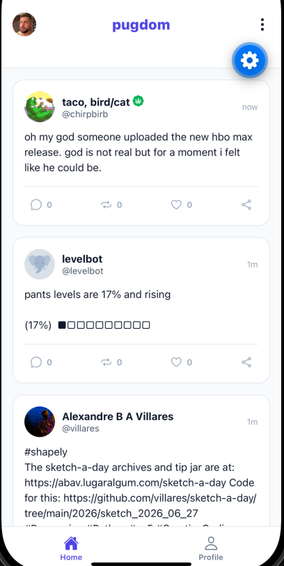
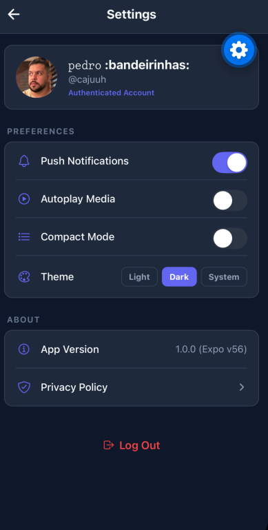
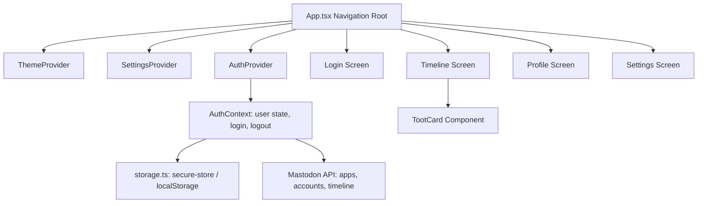

# 🐾 Pugdom

[](https://expo.dev/)
[](https://reactnative.dev/)
[](https://www.typescriptlang.org/)
[](https://opensource.org/licenses/MIT)

**Pugdom** is a gorgeous, premium, open-source cross-platform Mastodon client designed for the decentralized Fediverse. Powered by **Expo** and **React Native UI Lib**, Pugdom runs natively on **iOS**, **Android**, and the **Web** from a single TypeScript codebase. 

With its modern visual language, dynamic dark mode, and smooth interface, Pugdom makes exploring, reading, and interacting with the Fediverse a delightful experience.

---

## 📸 Screenshots

| 🏠 Home Timeline | ⚙️ Profile & Settings |
| :-: | :-: |
|  |  |

---

## ✨ Features

- 📱 **Multiplatform Out-of-the-Box:** Runs with high fidelity on iOS, Android, and Web browsers, reusing 99%+ of the codebase.
- 🐘 **Dynamic Mastodon Instance Auth:** Connects to *any* Mastodon instance in the Fediverse. The application dynamically registers itself (`POST /api/v1/apps`) on-the-fly and runs a secure OAuth2 flow via Expo's `WebBrowser` auth sessions.
- 🌐 **Rich Interactive Timeline:**
  - **Infinite Scroll & Pagination:** Dynamic loading using Mastodon's `max_id` pagination tokens.
  - **Pull-to-Refresh:** Built-in seamless refresh controls.
  - **Custom Emoji Support:** Renders custom emojis inline in status text and usernames dynamically.
  - **Content Warnings (CW):** Sensitive posts hide behind a clean collapsible spoiler banner with visual show/hide toggles.
  - **Link Cards & Media Grids:** Embeds web previews and multi-photo media attachments using custom grids.
  - **Micro-Interactions:** Fast boost (reblog), favorite (like), and share controls.
- 👤 **Premium Profiles:**
  - Dynamic user banner images (or beautiful color gradients if none exist).
  - Clean layout containing follow statistics, user bio parsing (cleared of HTML tags safely), and profile sharing.
  - Fast navigation between the timeline and your personal feed.
- ⚙️ **Advanced Preferences:**
  - **Theme Engine:** Fully custom dark, light, and system-adaptive styling.
  - **Compact Timeline Mode:** Toggle visual density for faster browsing.
  - **Autoplay & Notifications Toggle:** Fine-grained configuration settings.

---

## 🛠️ How It Works (Architecture)

Pugdom is structured with clean separation of concerns and modular service providers:



### Key Modules:
- **Authentication (`services/authContext.tsx`):** Holds the global user authentication state. Coordinates credentials retrieving, validating user details, and managing logouts.
- **Secure Persistence (`services/storage.ts`):** Utilizes `expo-secure-store` on native devices to store sensitive OAuth tokens and instance URLs safely. Falls back to browser `localStorage` when running on the Web.
- **API Clients (`services/mastodon/`):** Custom lightweight Axios wrappers communicating with Mastodon's APIs (`/api/v1/apps`, `/api/v1/accounts`, `/api/v1/timelines/home`, etc.).
- **Themes (`services/themeContext.tsx`):** Distributes styles and color palettes (Slate, Indigo, Slate-dark) dynamically based on theme choices (Light, Dark, System).

---

## 🚀 Getting Started

### Prerequisites

Ensure you have the following installed on your machine:
- [Node.js](https://nodejs.org/) (v18+)
- [Yarn](https://yarnpkg.com/) (recommended) or npm
- [Expo Go](https://expo.dev/client) app installed on your physical iOS/Android device (optional, for testing on device)

### Installation

1. **Clone the repository:**
   ```bash
   git clone https://github.com/cajuuh/pugdomv2.git
   cd pugdomv2
   ```

2. **Install dependencies:**
   ```bash
   yarn install
   ```

### Running the App

Start the Expo bundler:
```bash
yarn start
```

From the terminal interface, you can select where to run the app:
- Press **`i`** to open in the **iOS Simulator** (requires Xcode).
- Press **`a`** to open in the **Android Emulator** (requires Android Studio).
- Press **`w`** to open the **Web version** in your default browser.
- Scan the **QR Code** using your phone's camera (iOS) or Expo Go app (Android) to test on a physical device.

Alternatively, you can run directly using target commands:
```bash
# Run on Android emulator/device
yarn android

# Run on iOS simulator
yarn ios

# Run in the web browser
yarn web
```

---

## 📜 License

This project is licensed under the MIT License - see the [LICENSE](LICENSE) file for details.
